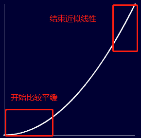
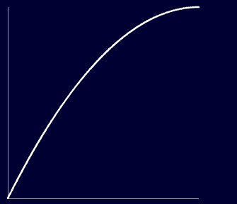
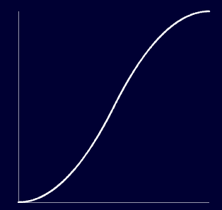

# rAF的好伙伴补间算法TWEEN

> 在[《9012年JavaScript还能写动画吗?》](../requsetAnimationFrame/requetAnimationFrame)中我们介绍了`requestAnimationFrame`（后面简称rAF），说到其的各种好处，但是“牡丹虽好，但仍需绿叶扶持”，好的剑刃需要配上趁手的剑柄才能发挥出更强的威力，rAF也不例外。

## 重回动画理论

如果在flash盛行的时期写过flash动画，亦或者是使用过AE写过动画就知道，这些软件制作简单动效其实非常的快捷：只要在对应的动画时间段的头尾时间插帧（frame），剩下内容软件就可以自己去补全，比如让一个圆形在0到10秒内从坐标点（0,0）移动到（0,300），那么我们只需要在时间轴0和10的点插入关键帧，然后分别把这个圆形放到（0,0）和（0,300），然后按播放键，你就会看到这个圆形用了10秒钟缓缓从（0，0）移动到（0,300）。这个过程非常傻瓜式，我们完全不用自己去计算任何东西。

显然我们使用JavaScript不会有那么容易，JavaScript根本不可能那么智能。但是css3好像可以，详细研究过animation相关的css属性的话就会发现，有一个属性叫做`animation-timing-function`，这个是用于设置动画的速度曲线的属性，规定css动画从一种样式变成另一种样式的所用的时间。这个属性设置所做的事情感觉和上面flash和AE自动替我们做的事情是同一件，那么到底JavaScript能不能做到相同的事情呢？

答案是可以的，但是要相应的算法支持。在介绍算法之前，我们先来理解一下算法到底要做些什么事情。先回到动画的原理，动画本质就是一幅幅画面快速移动而成，这里的每一幅静态的画面我们称作为帧。按这个角度去想，无论是flash和AE，还是css的`animation-timing-function`，都是为了帮我们做一件事：把始态和终态之间所随着时间推移所要展现的帧的内容帮我们自动生成出来。用回上面的例子，一个圆10秒钟从（0,0）移动到（0,300），第n（0<=n && n<=10）秒圆所要出现的位置，都是软件或者css帮我们计算好的了———这就是我们需要算法来帮助我们做的事情：一般情况下，我们都只是知道动画的始态和终态，然而每次调用rAF都代表渲染一帧新的画面，而这每一帧画面的内容我们不可能亲自去算，而是需要算法辅助我们计算出来。

## 补间算法TWEEN

补间算法是这样一种算法：给出开始状态，变化的状态量（结束状态 - 开始状态），整个持续时间和当前的时间，便可以得出当前时间的状态。这样我们就可以随心所欲去做我们想要动画。例如下面是一个线性运动曲线的补间算法函数：

```javascript
/**
* @param b Number 开始状态量
* @param c Number 变化状态量
* @param d Number 持续的时间
* @param t Number 当前的时间
* @returns Number 当前的状态量
*/

function linear(b, c, d, t) {

  return c * t / d + b;

};
```
可以看到，这其实是一个非常简单的线性函数的算法。那我们需要如何运用到rAF中去呢？请看下面代码：

```javascript
/**
* @param dom 要操作的dom元素
* @param positionArr 位置变换信息数组，第一项是开始位置，第二项是结束位置
* @param duration 动画持续时间
* 
*/
    function moveCircle(dom, positionArr, duration) {
        const beginPostion = positionArr[0];
        const endPosition = positionArr[1];
        let startTime = 0;
        function step(timestamp) {
          if (!startTime) {
              startTime = timestamp;
          }
          const progress = startTime - timestamp;
          const nowPosition = linear(beginPostion, endPosition - beginPostion, duration, progress); // 引用补间算法来获取当前时间的位置状态
          dom.style.transform = 'translateX(' + nowPosition + ')';
          if (progress <= duration) {
              requestAnimationFrame(step);
          }
        }
        requestAnimationFrame(step);
    }
```
从上面代码可以看到，在需要获取当前时间的状态的时候把相关数据输入这个补间变量算法就可以了，就是这么简单。

## 各种补间算法

上面我们看到了线性的运动曲线的补间算法，看上去很简单，但是这个是不是也太简单了？不要急，接下来会介绍其他的算法：

### 二次幂算法 / Quadratic 

#### easeIn / 淡入

```javascript
/**
* @param b Number 开始状态量
* @param c Number 变化状态量
* @param d Number 持续的时间
* @param t Number 当前的时间
* @returns Number 当前的状态量
*/
function quadeaseIn(b, c, d, t) {
    return c * (t /= d) * t + b;
}
```
算法的运动曲线如下：



其实就是一般的二次函数曲线图。但是我们从函数曲线图中也可以看到，这个算法为什么称为二次幂淡入算法：横坐标为时间，纵坐标为状态量，一开始平缓的部分表示动画的变化是比较慢的，后面速度就变得稍快一点而且变化速度基本保持一致。后面将不会重复叙述。

下面是以小球的移动动画为例的演示


#### easeOut / 淡出

```javascript
/**
* @param b Number 开始状态量
* @param c Number 变化状态量
* @param d Number 持续的时间
* @param t Number 当前的时间
* @returns Number 当前的状态量
*/
function quadeaseOut(b, c, d, t) {
 return -c *(t /= d)*(t-2) + b;
}
```
算法的运动曲线如下：



动画实例：


#### easeInOut / 淡入淡出

```javascript
/**
* @param b Number 开始状态量
* @param c Number 变化状态量
* @param d Number 持续的时间
* @param t Number 当前的时间
* @returns Number 当前的状态量
*/
function easeInOut(b, c, d, t) {
    if ((t /= d / 2) < 1) return c / 2 * t * t + b;
    return -c / 2 * ((--t) * (t-2) - 1) + b;
}
```
算法的运动曲线如下：



动画实例：


由于算法很多，这里就不一一去详细介绍，更多算法可以参见：

具体代码：[TWEEN.js](./TWEEN.js)

演示效果： [张鑫旭的博客: 《Tween.js动画算法使用示意实例页面》](https://www.zhangxinxu.com/study/201612/how-to-use-tween-js.html)

运动曲线&效果演示： [Robert Penner’s blog： 《easeing demo》(需要用到flash)](http://robertpenner.com/easing/easing_demo.html)

## 结语

有了TWEEN，我们就不需要担心使用rAF编写动画不知道如何去计算动画如何去缓动了。想要什么样的缓动效果就去调用对应的算法就可以了。

*Homer 2019.4.10*

*参考：*

[*TWEEN.js*](https://github.com/zhangxinxu/Tween)

[*JavaScript Tween算法及缓动效果*](http://www.cnblogs.com/cloudgamer/archive/2009/01/06/Tween.html)

