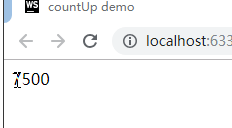

#疯狂跳动的数字——数字快速增长/减少动效

看过一些倒计时或者主要用来展示一个会变化的数字的场景的同学，估计会看过这样一个的效果，数字会不停的增长变化，直到变成目标数字。


(由于动画是循环的，所以会一直跳动，实际效果是会在目标数字之后停止下来)

那这个效果应该如何实现呢？显然用css3是写不出来的，所以只能使用JavaScript的动画利器rAF来写了。

先把这个动画分析一下，可以发现它其实就是随着时间的变化不停的修改dom的`innerText`来达到目的。但是稍微仔细想想，那我们该如何去决定什么时候显示什么数字呢？
别担心，有TWEEN算法，我们就可以为所欲为。下面我们来看一下代码：

```javascript
/**
* @param dom 需要操作的dom
* @param startnum 开始的显示数字
* @param endnum 结束的显示数字
* @param duration 动画的持续时间, 毫秒为单位
*/
function countUp(dom, startnum, endnum, duration) {
        dom.innerText = startnum;
        let startTime = 0;
        let progress;
        function step(timestamp) {
            if (!startTime) {
                startTime = timestamp;
            }
            progress = timestamp - startTime;
            // 为了美观，对显示的数字进行取整
            dom.innerText = Math.ceil(easeOutQuad(startnum, endnum - startnum, duration, progress));

            if (progress <= duration) { // 判断动画是否需要持续
                requestAnimationFrame(step);
            }
            // 需要循环执行动画的话则在这里加上else然后加上setTimeout执行本函数即可
        }
        requestAnimationFrame(step);
        function easeOutQuad(b, c, d, t) { // 使用了二次幂的淡出算法
            return -c *(t /= d)*(t-2) + b;
        }
    }
```
最后调用这个函数就可以实现这个效果了

```javascript
const dom = document.getElementById('number');
countUp(dom, 0, 7500, 5000);
```
最后看一下效果：



想尝试一下代码可以点这里看这个页面：[demo.html](./demo.html)

本次效果分享到此为止啦，希望对大家有所帮助~~

*Homer，2019.4.11* 

*参考：（虽然可能算法不一样，但是想法还是参考了一下，有兴趣可以看一下）*

[*countUp.js*](https://github.com/inorganik/countUp.js)
