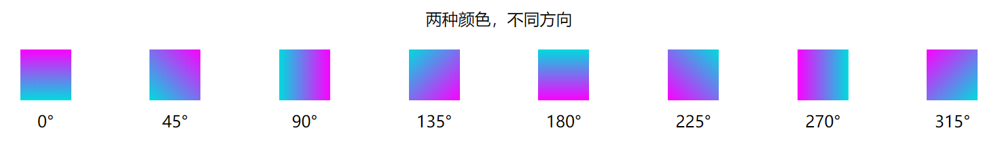
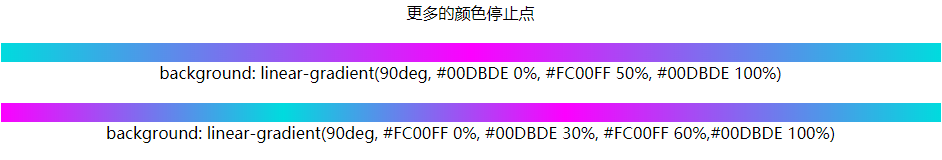

# 动态线性渐变的实现


> 本文主要探究双色动态线性渐变的效果如何实现。

## 前端：静态颜色线性渐变的实现

渐变是在色彩上的一个相对缓慢的过度，我们的视觉会随着这个渐变的过度而产生一种流动感，而这种流动感全凭在色彩上发生的种种变化。

渐变主要分成两种主要形式，分别是线性渐变和径向渐变。
线性渐变值指的是是沿着一根轴线（水平或垂直）改变颜色，从起点到终点颜色进行顺序渐变（从一边拉向另一边）；径向渐变则是从起点到终点颜色从内到外进行圆形渐变。（从中间向外拉）。

在前端，我们也完全可以用代码实现这些色彩效果，而实现的方式有三种：css，canvas以及svg。
今天我们只讨论线性渐变。接下来，先来看一下这三种方式的实现方法：

### css
我们首先来看用css怎么去实现一个简单的渐变效果：

```css
.linear-gradient{
    background-image:linear-gradient(0deg, #08AEEA 0%, #2AF598 100%);
}
```
效果是这样的：


css主要使用两个函数`linear-gradient`来创建线性的颜色渐变，基本语法如下：

`linear-gradient([方向/角度], 颜色1 [位置/百分比], 颜色2 [位置/百分比], ...)`

生成的渐变图层会被视为css中的一个image(图片)对象，所以可以用在以下css属性上：
* `background-image`
* `list-style-image`
* `border-image`
* `cursor`
* 用 CSS `content`属性，和CSS伪元素 `::after` 和 `::before`替换元素内容
* `mask`(遮罩属性，webkit内核浏览器需要加`-webkit-`前缀)

下面是一个渐变用作边框的例子
```css
.linear-border{
            border: 30px solid ;
            border-image: linear-gradient(0deg, #08AEEA 0%, #2AF598 100%) 10;
}
```
效果如下：


(附：`border-image`的基本用法：[MDN](https://developer.mozilla.org/zh-CN/docs/Web/CSS/border-image))

另外，只要css渐变的填充颜色是不完全透明的话，渐变图层还可以进行多个叠加。

下面就是一个例子：
```css
 .linear-mix{
            background:
                    linear-gradient(217deg, rgba(255,0,0,.8), rgba(255,0,0,0) 70.71%),
                    linear-gradient(127deg, rgba(0,255,0,.8), rgba(0,255,0,0) 70.71%),
                    linear-gradient(336deg, rgba(0,0,255,.8), rgba(0,0,255,0) 70.71%);
        }
```

效果：


基本用法说到这里差不多了，更多的详细说明请看[MDN](https://developer.mozilla.org/zh-CN/docs/Web/Guide/CSS/Using_CSS_gradients)上的说明.

### canvas
接下来是canvas中渐变的实现方法：

```javascript
const canvas = document.getElementById('canvas');
const ctx = canvas.getContext('2d');
const linearGradient = ctx.createLinearGradient(canvas.width / 2 , 0, canvas.width / 2, canvas.height);
linearGradient.addColorStop(0, '#08AEEA');
linearGradient.addColorStop(1, '#2AF598');
ctx.fillStyle = linearGradient;
ctx.fillRect(0, 0, canvas.width, canvas.height);
```

效果如下：


在canvas中需要先使用canvas主要绘画对象——context对象的`createLinearGradient`方法来创建一个渐变对象，然后再往渐变对象里添加颜色和颜色范围。
最后，把这个渐变对象赋给图像的填充样式`fillStyle`或者描边样式`strokeStyle`再上色，就可以使得相应的图像拥有渐变的颜色了。

`createLinearGradient` 方法接受 4 个参数，表示渐变的起点 (x1,y1) 与终点 (x2,y2)。

添加的线性渐变canvas也是可以实现的，只要

由于篇幅及研究范围所限，svg的渐变实现方法我就不做进一步介绍了，想了解的可以查看[MDN](https://developer.mozilla.org/zh-CN/docs/Web/SVG/Tutorial/Gradients)

## 渐变：不同的颜色数量、间距产生的效果

OK，实现说完了，接下来我们来聊聊线性渐变的一些效果例子。先来总结一下，从上面的举的例子可以看得出，线性渐变有三个重要的变量：
1. 渐变直线的方向，在css中具体选项为第一个参数，不填的时候默认为正中央的上到下（同 `to bottom`），可以填具体的方向或者角度；
而在canvas中的具体表现为一条从(x1,y1) 到 (x2,y2)直线。
2. 渐变的颜色，这个很容易看得出来吧。
3. 渐变颜色的停止点，在css中就是颜色后面的参数，可以填0%~100%的数字，或者具体长度；
canvas则规定比较死，为0到1之间的数。

厘清这些内容之后，我们就可以用经典的“控制变量法”来探究一下线性渐变到底可以做出哪些效果了。

### 两种颜色

渐变最重要的条件就是颜色，我们来先定量颜色的数量，然后控制其他两个变量看看会有什么的效果。

我们选取的两个颜色为  `#00DBDE` 和  `#FC00FF`，这两个颜色渐变起来非常好看。

#### 渐变方向

我们先来看看不同方向的效果。

代码：

```html
<div style="display: flex;justify-content: space-between;width: 960px;height: 200px; margin: 20px auto;">
    <div style="background: linear-gradient(0deg, #00DBDE, #FC00FF);width: 50px;height: 50px;"></div>
    <div style="background: linear-gradient(45deg, #00DBDE, #FC00FF);width: 50px;height: 50px;"></div>
    <div style="background: linear-gradient(90deg, #00DBDE, #FC00FF);width: 50px;height: 50px;"></div>
    <div style="background: linear-gradient(135deg, #00DBDE, #FC00FF);width: 50px;height: 50px;"></div>
    <div style="background: linear-gradient(180deg, #00DBDE, #FC00FF);width: 50px;height: 50px;"></div>
    <div style="background: linear-gradient(225deg, #00DBDE, #FC00FF);width: 50px;height: 50px;"></div>
    <div style="background: linear-gradient(270deg, #00DBDE, #FC00FF);width: 50px;height: 50px;"></div>
    <div style="background: linear-gradient(315deg,#00DBDE, #FC00FF);width: 50px;height: 50px;"></div>
</div>
```

代码中的角度可以理解为两种颜色有一条分界线，这个角度就是这条分界线的顺时针所旋转的角度。

效果：




就是颜色分布的角度不同了而已，不是很特别。

#### 颜色停止点

要稍微提一点的就是，无论是css还是canvas中，如果声明的时候颜色没有充满渐变方向的两端（即css中的0%和100%，canvas的0和1），离两端最近的颜色会自动填充到两端去。

接下来我们来试试不同颜色停止点形成的效果。
首先尝试的是两个颜色停止点的渐变。

代码：

```html
<div style="display: flex;flex-direction:column;justify-content: space-between;width: 940px;height: 500px; margin: 20px auto;">
    <div style="background: linear-gradient(90deg, #00DBDE 10%, #FC00FF 10%);width: 100%;height: 25px;"></div>
    <div style="background: linear-gradient(90deg, #00DBDE 10%, #FC00FF 20%);width: 100%;height: 25px;"></div>
    <div style="background: linear-gradient(90deg, #00DBDE 10%, #FC00FF 30%);width: 100%;height: 25px;"></div>
    <div style="background: linear-gradient(90deg, #00DBDE 10%, #FC00FF 40%);width: 100%;height: 25px;"></div>
    <div style="background: linear-gradient(90deg, #00DBDE 10%, #FC00FF 50%);width: 100%;height: 25px;"></div>
    <div style="background: linear-gradient(90deg, #00DBDE 10%, #FC00FF 60%);width: 100%;height: 25px;"></div>
    <div style="background: linear-gradient(90deg, #00DBDE 10%, #FC00FF 70%);width: 100%;height: 25px;"></div>
    <div style="background: linear-gradient(90deg, #00DBDE 10%, #FC00FF 70%);width: 100%;height: 25px;"></div>
    <div style="background: linear-gradient(90deg, #00DBDE 10%, #FC00FF 90%);width: 100%;height: 25px;"></div>
    <div style="background: linear-gradient(90deg, #00DBDE 10%, #FC00FF 100%);width: 100%;height: 25px;"></div>

</div>
```
我们固定了前一个颜色停止点，然后不断改变后一个颜色的停止点，看看效果：


是不是发现了什么！“其他的都很正常，可是为什么第一条没有渐变效果？”这个问题提的很好。
显然，颜色的渐变是一个慢慢过渡的过程，这个过程在图像上表现为一条颜色变化的色带。
为什么css和canvas的实现线性渐变方法中都需要为每个颜色的停止点呢？
这是因为，渐变需要根据这些点来确定三块区域：前一种颜色的区域，渐变过程区域，后一种颜色的区域。可以来一下图来感性感受一下：


可以看出，图上0-10%长度区域为#00DBDE的颜色区域，10%-50%为渐变区域，50%-100%为#FC00FF的颜色区域。
而且这三个区域跨度都可以为0：当两个颜色停止点位于渐变两端的时候，对应颜色区域的跨度就变成0；当两个颜色停止点的位置一样的时候，渐变过程的区域跨度就变成0。
这就是为什么第一条没有渐变效果的原因——毕竟没有了渐变过程的区域，颜色就没有了渐变过渡的过程，就会直接从一种颜色切换成另一种颜色。

那三个停止点、四个停止点的效果呢？



顺便一提，如果是用重复循环的线性渐变效果，可以使用css的`repeating-linear-gradient`函数
