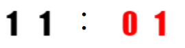
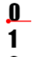

# 篮球比分几比几——纯js实现的数字轮盘转动动效

> 原谅我这次标题党了哈，这其实就是一个数字的翻牌器的动画效果，只不过，我们可以自己完全去用js来实现而不需要用到其他东西。

先来看看效果：



(ps:1.为了响应题目特意做了红黑的篮球比分牌的样子；2.gif是循环的哦~~)

这种效果让我做的话，我一开始是用会四列的`<ul>` 和 `<li>`来实现。转动的列表嘛，最直观的就是这样了。
这种方法最麻烦就是要做两三层的包裹，然后各种设置`overflow`,特别是有些时候还有恶心的滚动条出现，滚动条不仅不美观，还会让我们算出来的每个元素宽度有误差，其实不算是很好的方法。

但是这是过去的事情了。以前我没得选，现在我想~~做个好人~~用`background-position`。

*Σ(っ°Д°;)っwhat?! `background-position`能写这玩意？*

没错，就是能写。如果想不到怎么写的朋友可以先去回忆一下雪碧图这个知识点。

*(ΩДΩ)诶，雪碧图？这个吗？*


不对，我们这里的雪碧图是指**Image sprites**技术，也可以称之为 CSS 贴图定位、图像精灵（sprite，意为精灵），被运用于众多使用大量小图标的网页应用之上。它可取图像的一部分来使用，使得使用一个图像文件替代多个小文件成为可能。相较于一个小图标一个图像文件，单独一张图片所需的 HTTP 请求更少，对内存和带宽更加友好。
[详情可以查看MDN的介绍](https://developer.mozilla.org/zh-CN/docs/Web/Guide/CSS/CSS_Image_Sprites)

这里的雪碧图能够实现的原因就是css上有`background-position`的属性，在一张图片上取不同的位置作为背景，就可以得到不同背景。

*o(￣▽￣)ｄ 好，这个我懂了，那它和我们今天要讲的动效有什么关系呢？*

想一下~~如果`background-position`动起来了，会有什么样子呢？

*⊙(・◇・)？会上下左右动...这有什么特别的吗...*

没错，只能上下左右动。但是这样动起来的话，不就可以实现我们今天的动效了吗？

如果，设计狮大大给到这样一张图片：


再结合我们刚讨论的`background-position`，是不是就知道要怎么做了？

*(゜-゜)上下移动的话...*

没错，我们可以通过一帧帧向上或者向下来改变`background-position`的值来达到数字轮盘的效果！


*(｀⌒´メ)哼！*

嗯？ 怎么了？

*(｀⌒´メ)说好的纯js实现呢？所以你还不是要有图才能做？如果设计狮大大不给图你还不是什么都做不了！*

你这还真的说到点上了，要图的每做一款动效都要画图，这岂不是很麻烦？

别急，我们可是前端er，图这东西只要是不复杂，我们还能自己画嘛~~

接下来，让我们掏出canvas，画画儿~~:

```javascript
const canvas = document.createElement('CANVAS'); // 首先我们先创建一个canvas
    canvas.height = (30 + 5) * 10; // 然后设定canvas的长宽，这个跟我们要设定的字体有关 
    canvas.width = 40; // 我们假设需要做一个30px的字，距离上下左右的间距为5px的图
    const ctx = canvas.getContext('2d');
    ctx.font = '30px Impact'; // 设置字体大小和字体样式
    ctx.fillStyle = 'red'; // 设置字体样式
    for (let i = 0; i < 10; i++) { // 开始循环写数字
        ctx.fillText(i, 5, 30 + (i * 35));
    }
```

这小段代码就可以给我们画出用于做动画的简单数字图： 


在这里我们设定了数字的大小为30px，上下间距为5px，所以相应的canvas的总高度为：**（30 + 5） * 10**；因此每一个数字i的对应的高度就为**i * 35**（这个数字很重要，后面会说到）;

>  在这里圈个重点，你会发现我们代码中开始在canvas写文字是从坐标（5, 30）开始画起的，你可能就要问了：为什么不是从（5,0）的位置画？你从（5,30）开始画不就顶上留有30px的空隙了吗？
还真没有空隙。因为**canvas的文字的左边是和一般的不同的**。我们一般canvas或者dom的元素，都是以左上角的点为对齐坐标的标准点，但是canvas的文字不是，它是以左下角的点为标准点的；更确切的说，是以文字的baseline的最左端作为标准点。不信？我们在（5， 30）处画个点和一条线就可以看到：


>

> 所以这里就要稍微注意一下。

做出来之后我们完全不需要加到dom中去，可以直接从canvas上导出来：
```javascript
const bgimg = canvas.toDataURL();
```
这样我们就有了一条可以用的图了~~~

*(oﾟ▽ﾟ)然后呢然后呢！*

然后我们就可以继续写下去了——把背景图设置到dom上，然后使用之前提到的rAF和Tween来编写动画：

首先是rAF模块，这次使用了回调函数使得rAF可以从函数中独立出来，达到让rAF和其他动画模块的解耦的效果。
```javascript
/**
* rAFPart
* @param duration 动画的执行时间
* @param callback 回调函数，用来改变dom样式，会获得progress当前时间进程和duration动画执行作为参数，方便调用TWEEN
*/
function rAFPart(duration, callback) {
        let startTime = 0;
        function rolllingStep(timestamp) {
            if (!startTime) {
                startTime = timestamp;
            }
            const progress = timestamp - startTime;
            callback(progress,duration);
            if (progress <= duration) {
                requestAnimationFrame(rolllingStep);
            }
        }
        requestAnimationFrame(rolllingStep);
    }
```

其次是TWEEN函数，用于计算区间插值：(参数就不再重复注释啦)
```javascript
 function Tween(t, b, c, d) {
        if ((t /= d / 2) < 1) return c / 2 * t * t + b;
        return -c / 2 * ((--t) * (t - 2) - 1) + b;
    }
```

然后我们就可以来写一下效果：

```javascript
let cacheRed1 = 0; // 设置四个全局变量来缓存目前四个数字的background-position，这个是红色的个位数
let cacheRed2 = 0;  // 红色 十位
let cacheBlack1= 0; // 黑色 个位
let cacheBlack2 = 0; // 黑色 十位
function rolling() {
        const cr1 = cacheRed1++;
        const br1 = cacheBlack1++; // 缓存执行滚动前的background-position数据
        rAFPart(1000, (progress, duration) => { // 执行个位数的翻牌滚动
            const red1BgPos = Math.ceil(Tween(progress, cr1 * 35, 35, duration).toFixed(2));
            const blk1BgPos = Math.ceil(Tween(progress, br1 * 35, 35, duration).toFixed(2));
            BlackNumber[1].style.backgroundPosition = '0 -' + blk1BgPos + 'px';
            RedNumber[1].style.backgroundPosition = '0 -' + red1BgPos + 'px';
        });
        if (cacheBlack1 >= (cacheBlack2 + 1) * 10) { // 判断黑色十位上的数是否需要翻牌
            const br2 = cacheBlack2++; // 缓存然后自增
            rAFPart(1000, (progress, duration) => { // 执行翻牌动作
                const pos = Math.ceil(Tween(progress, br2 * 35, 35, duration).toFixed(2));
                BlackNumber[0].style.backgroundPosition = '0 -' + pos + 'px';

            });
        }
        if (cacheRed1 >= (cacheRed2 + 1) * 10) { // 判断黑色十位上的数是否需要翻牌
            const cr2 = cacheRed2++;
            rAFPart(1000, (progress, duration) => {
                const pos = Math.ceil(Tween(progress, cr2 * 35, 35, duration).toFixed(2));
                RedNumber[0].style.backgroundPosition = '0 -' + pos + 'px';

            });
        }
        setTimeout(() => { // 重复执行
            rolling();
        }, 1500)

    }
```

这里面有两个点要解释一下，首先是我们没有详细去记具体的`background-position`，而是用了0-9的数字来表示，是因为我们上面画数字图的时候就已经知道一个数字所占的高度是多少，所以每个数字在哪个位置我们都知道的清清楚楚；而且如果我们后面要跳转到指定数字的时候，用0-9显然更好设计程序来判断。然后是要注意缓存，rAF模块不是一次就执行完的，它每次执行回来调取回调函数的时候都要用到上一次自增之前的`background-position`来加入到TWEEN中计算，所以要先把值给缓存下来，不然会出现bug。

好，到此为止，效果就做好啦！再次放一下效果图：


*最后加料：* 在浏览器调试的时候发现了`background-position`的位置如果超过了图片大小浏览器就会去自动repeat来延长，也就是我上面的长350的数字图片，如果把`background-position`的高度设置为350px，浏览器就会显示repeat的图片的0px的位置作为背景，所以要做多圈轮转动画的朋友，知道该怎么做了吗？（斜眼笑）

*最后的最后啰嗦一下：* 这个效果用来动效是没问题的，因为它不需要交互。但是需要交互情况下，这个效果就估计不适用了哦~~

*Homer 2019.04.21*

*参考* 

[*jQuery之家的一个付费效果*](http://www.jq22.com/jquery-info15989)

*不，我没有买这个效果的源码，我只是按了一下F12，然后做了一下分析而已~~*


[在 CSS 中实现图像合并](https://developer.mozilla.org/zh-CN/docs/Web/Guide/CSS/CSS_Image_Sprites)

*END*
